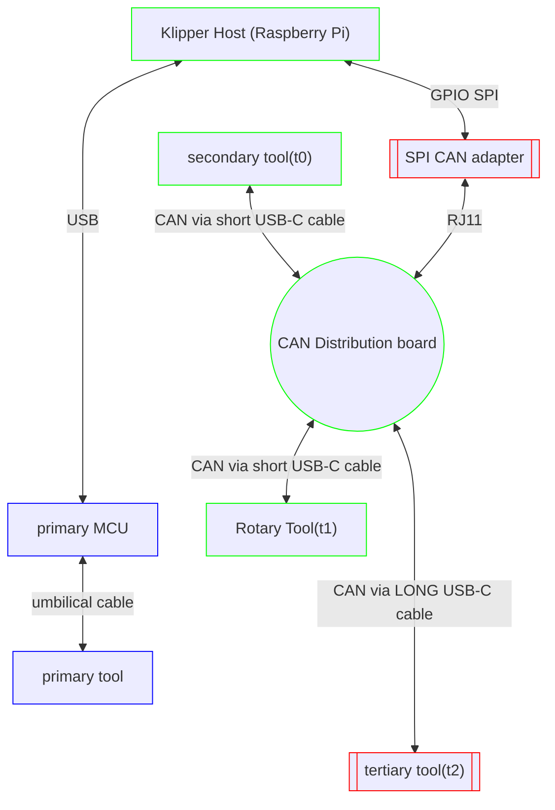
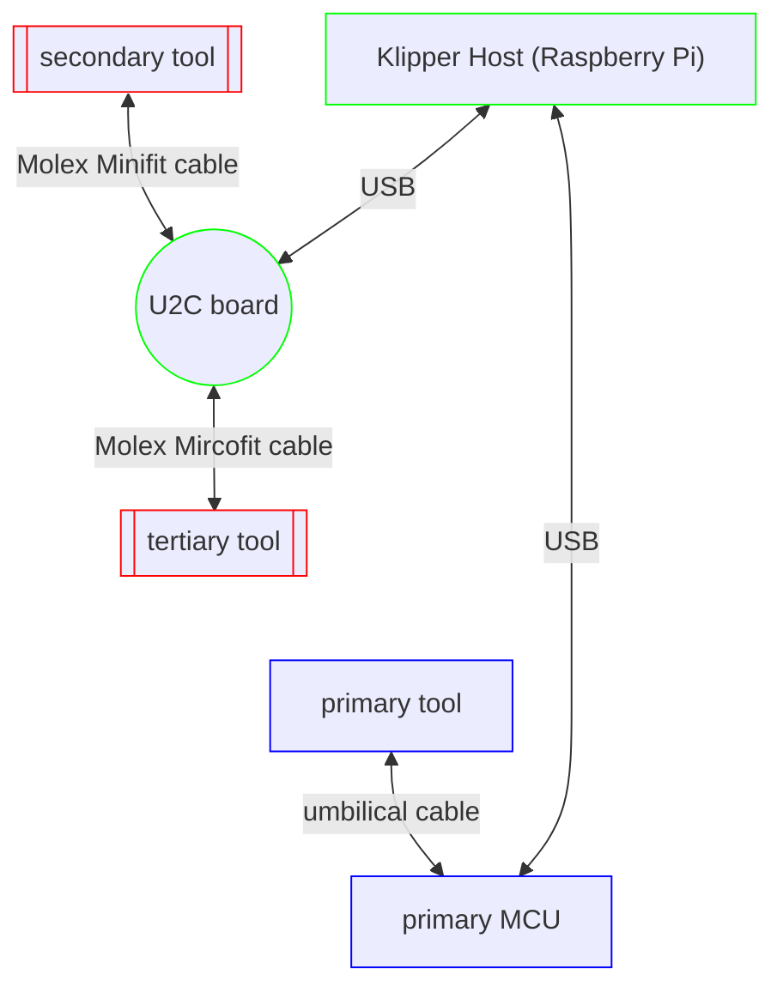
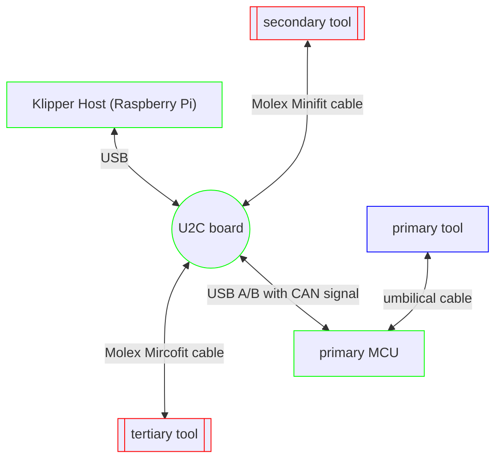
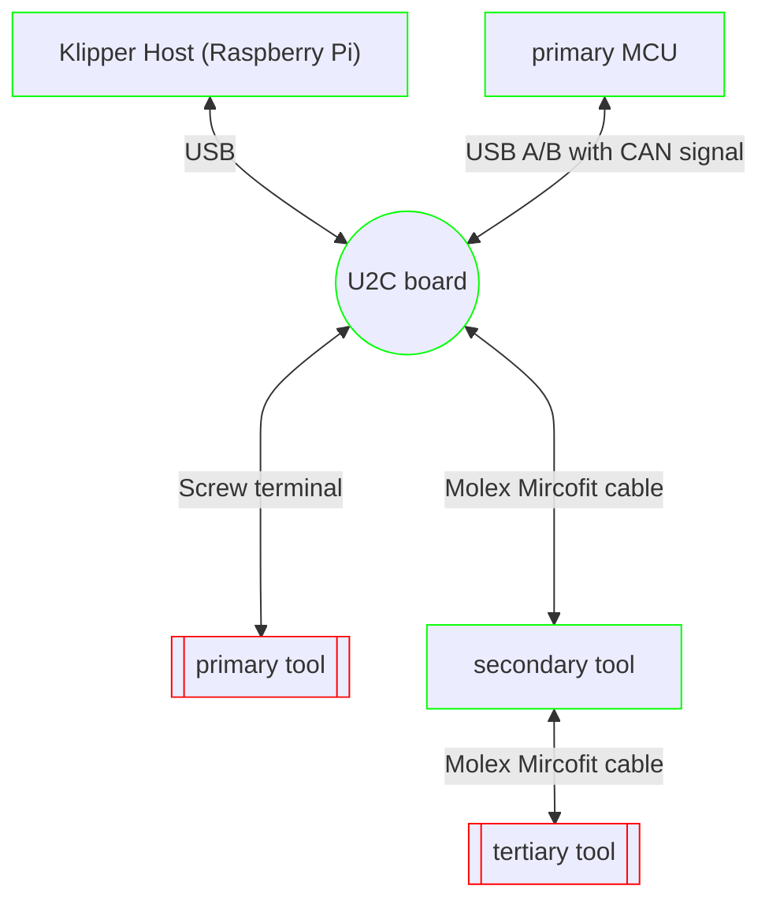
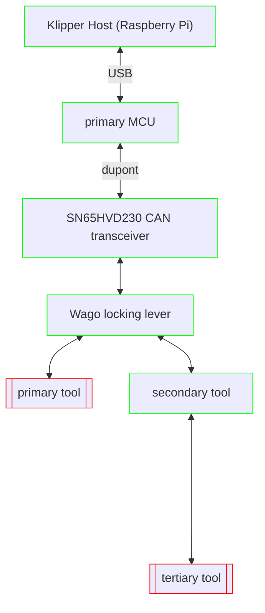
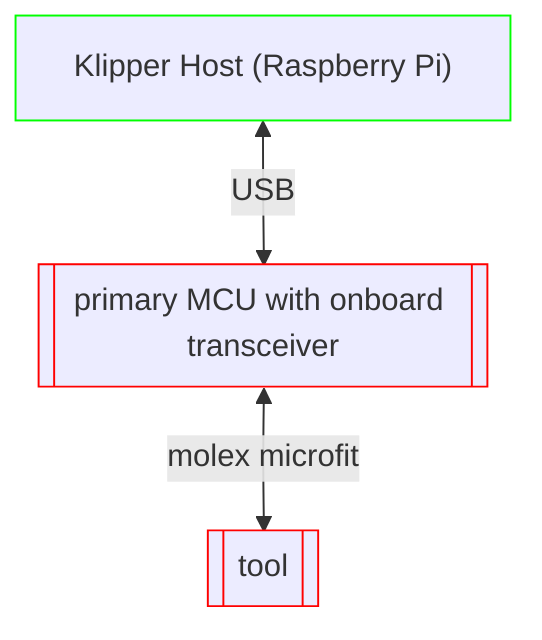
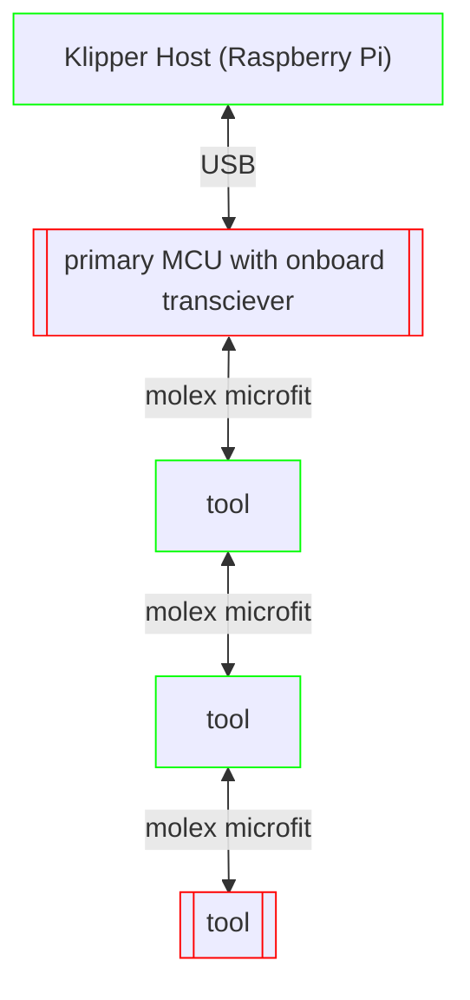
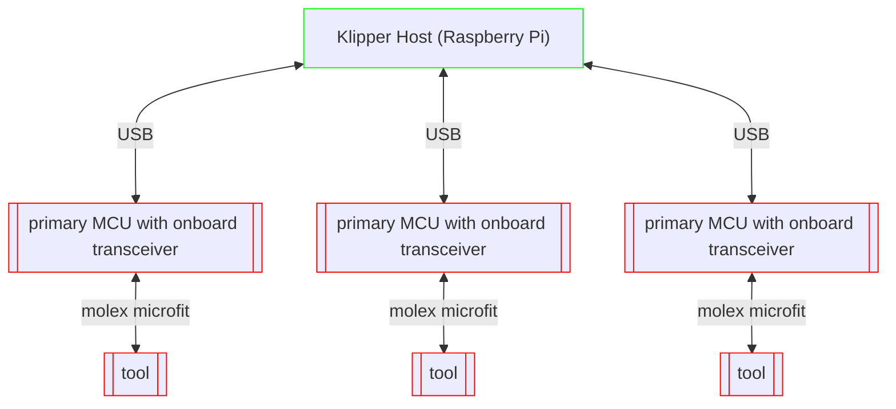

# CAN bus: The Briefest of Introductions

This document provides a conversational and ambling introduction to CAN bus, as well as several case studies of possible CAN bus configurations and topologies. More technical information is available in the Klipper documentation, as well as cited throughout this text.

Klipper allows a host process to connect to a printer's MCU. Many printers have a single MCU to which all I/O (steppers, sensors, heaters) are connected.

As one adds more peripherals to a printer, the main MCU may begin to run out of available pins. Or, perhaps one wishes to add a concentration of I/O in an area a little further from the primary MCU (generally located in the *chassis*), and wishes to reduce wiring (cable) clutter back to a larger main board.

<figure>
    
    <figcaption>An example of a cluttered chassis. Note the difficulty of accessing lower layers of the board and RPi GPIO due to stacked daughter board.</figcaption>
</figure>

Klipper allows the use of multi-MCU in these cases. These additional MCUs may be connected via USB or serial. But many smaller SBCs (__Single Board Computer__: a small ARM based computer usually used to deploy Klipper, Raspberry Pi being the most popular example), especially the Zero form factor, only have two USB ports... One for power, and one for a USB device. Whereas a user with an MMU (multi-material unit) and several tools which can change during a print may have four or five MCUs to connect simultaneously.

## What is CAN bus

CAN bus is a *linear network topology*. CAN stands for __Controller Area Network__. Originating from the early 1980's, CAN bus grew popular in the automotive industry to connect all the various pieces of a car, and for factory floor automation. CAN bus runs on two wires, CAN High (can_h), and CAN Low (can_l). These two wires carry a *differential signal*, that is, the same magnitude signal where one is positive and the other negative, i.e. abs(can_l) = abs(can_h). By twisting the wires of this differential pair, greater resilience to interference is created, because the difference between the signals is still the same.

The linear topology of CAN bus means that each device on the bus communicates with every other device. This is in contrast to a star topology, where each device communicates with a central hub, and the hub communicates with each device. 

CAN bus is *terminated* at both ends of the line. This termination helps to reduce ringing on the line, and is usually achieved by placing a 120Ω resistor between can_h and can_l. CAN bus may also be terminated in a split termination scheme, in which two 60Ω resistors are connected in series between can_h and can_l, and a capacitor connected to ground is placed between them.

At a high level, CAN bus helps make I/O *plastic*, by adding a little or a lot just where it's needed. This sort of fluidity makes understanding CAN bus topology a little more challenging at first because so many different configurations are possible. 

Not every MCU is CAN bus capable. Many STM32 and SAM MCUs implement CAN bus in hardware. CAN bus is implemented in software (in the PIO cores) on RP2040.

An MCU doesn't create the final CAN signal directly. It communicates with a device called a *CAN transceiver* which creates the differential signal from two pins on the MCU. Some boards have a transceiver built in, but for many older boards, you'll need to solder and/or wire one yourself. If you're building from the ground up, or shopping for new hardware to implement your CAN bus designs, it's probably preferable to exclude boards without a transceiver built in.

Klipper implements CAN 2.0, which has a maximum speed of 1,000,000 bits per second. The newer CAN FD (Flexible Data Rate) has a maximum speed of 8,000,000 bits per second, but is not currently supported by Klipper. CAN FD is backwards compatible with CAN 2.0. Some newer devices feature a CAN FD transceiver, which will work just fine with Klipper's CAN 2.0 implementation.

## Motive, or, Do I Need CAN?

If your printer is working great, and you're happy with it, you don't need to add CAN bus. It won't make your printer better, or faster in and of itself. It's also worth noting that Klipper's CAN bus bridge mode will NOT be stable with only a single MCU, so switching your single MCU to CAN bus bridge would actually be a detriment. CAN bus is a useful addition for people who need to add I/O to their printer, or who like to have more readily accessible ports for testing and experimenting with hardware. 

<figure>
    
    <figcaption>CAN bus enables easy experimentation such as testing this mass dampened piezo probe on an FLSun SR</figcaption>
</figure>

CAN bus could simplify (or complicate, depending on how you think about it!) the addition of an accelerometer to a toolhead. Accelerometer data may be used with Klipper's input shaping technology, which reduces printer vibrations for better, often quieter, prints.

CAN bus is especially convenient for parts of the printer that might be further away from the primary MCU such as toolheads and multi-material units.

## Wiring/Topology

CAN bus is two wires: can_h and can_l. These two wires are a linear network topology, and connect to each device on the CAN bus. Many users also route power along with the CAN wires. 

CAN bus is *terminated* at both ends by either a 120Ω resistor, or a split termination scheme. Proper termination helps ensure stability of the CAN bus line by reducing ringing.

<figure>
    
    <figcaption>A U2C with different plug types labeled</figcaption>
</figure>

There isn't a standard CAN plug type. Some early boards for printers used USB-C PD wires to carry the CAN signal and power. Many end users have strong expectations about how a USB-C plug should work, though, and, coupled with the physical instability of the plug some users experienced on a rapidly moving toolhead, the choice proved less than ideal. Other boards might use screw terminals, molex minifit, molex microfit, or break out the data wires to jst-xh. Some devices use an xt30(2+2) plug. You'll probably need to be prepared to crimp cables to set up your CAN bus capable board, and you may need to spend some time troubleshooting the connection (for instance, rotating the plug 180º to get the signal working on some devices using a coopted USB-C cable). 

<figure>
    
    <figcaption>XT30 2+2
</figcaption>
</figure>

Non-terminating nodes may be branched from the linear CAN bus line by short connecting wires called *stubs*. Stubs should be kept as short as possible, and there should never be consideration of a 'long stub.' As a general rule of thumb, the standard recommends that a stub should be no longer than 0.3m (30 cm) when using a 1Mbps signaling rate[^1].

[^1]: [Controller Area Network Physical Layer Requirements, pg. 10](https://www.ti.com/lit/an/slla270/slla270.pdf)

That said, wiring is where CAN bus shines. 

## The CAN bus Bridge

Klipper's host process runs on an SBC, so for it to talk to CAN devices, it will need to be attached to the CAN bus... Somehow... Most SBCs don't have CAN bus onboard (RK3568, RK3588, and RK3582 based devices do, but they'll need a transceiver), so most users add CAN connectivity via either SPI or a USB adapter. SPI adapters tend to require a little more work to configure, and, as a result, USB adapters have probably become more popular. 

This has been especially true since Klipper introduced CAN bus bridge mode. This mode allows capable MCUs to be configured to bridge CAN communications via USB. 

You might have seen devices such as the BTT U2C that operate solely as CAN bus bridges. These are very useful for working with older MCUs that don't have CAN transceivers on board. They're probably a little easier to configure than soldering your own transceiver. Many STM devices may be configured to output the CAN bus signal on the USB port, and these devices allow connecting those directly, avoiding searching for available pins and soldering all together.

The U2C bridge does require power, and if you're hoping to power your SBC with it, you'll have to get it from either your MCU's USB port, or some other available power pins. You may need to set a jumper to connect the USB port to the 5v rail, or solder over a diode on the USB VIN line. Consult your board's schematic as necessary.

## Toolhead Boards

Perhaps the most popular use of CAN bus in Klipper is the toolhead board. A tool tends to be an I/O dense region, usually incorporating at minimum fans, a heater, an ADC for temperature measurements, a bed probe, and a stepper driver for the extruder. All the I/O from the tool can be wired to the toolhead board, and only the 2 CAN bus and 2 power wires need be routed back to the primary MCU or U2C (depending on topology). Additionally, most if not all toolhead boards have their own 5v regulator, bringing a little extra breathing room to an often heavily loaded 5v rail on the main MCU.

<figure>
    
    <figcaption>BTT EBB42 on Mini SB</figcaption>
</figure>

Some printers have several tools configured and all available for use during a single print. Toolhead boards ensure the availability of ports and wiring simplicity for these multitool setups.

Utilizing a CAN Bus setup offers significant advantages in terms of modularity and flexibility. By reducing the amount of wiring needed it may help to make the overall setup easier to manage and modify, allowing for such things as different toolheads to be swapped out easily and quickly managed through the configuration files.

<figure>
    
    <figcaption>A fystec sb CAN th board</figcaption>
</figure>

A CAN bus cable is an easy breakpoint for modular setups, which involve switching tools manually and toggling a few lines in `printer.cfg`. For example, a delta printer with magballs and CAN bus could have an extruder and a laser mounted on separate effector plates that can be switched out by powering down the printer and unplugging the single CAN cable. Or, a MendelMax could be retrofitted with a [TapChanger](https://github.com/viesturz/tapchanger) and switch tools by powering down, lifting the tool off the shuttle, changing the cable, and toggling the configuration in Klipper. (It's worth noting that CAN bus cables carrying power are NOT hot-swappable. Power the machine down completely before changing.) Such configurations save both costs and space by allowing sharing and reuse of a kinematic system with different tools. 

<figure>
    
    <figcaption>Mendel Max with TapChanger used to switch between 1.75mm Sherpa and 2.85mm Orbiter</figcaption>
</figure>

## Topologies

Let's get our feet on the ground by examining a few possible CAN bus topologies. Terminating nodes in the following scenario diagrams are represented by a red border with double side edges. Non-terminated CAN elements are green, and non-CAN nodes are blue.

<figure>
    
    <figcaption>A CAN Distribution Board with SKR Pico in Bridge Mode</figcaption>
</figure>

### Scenario 1: The CAN bus Distribution Board with SPI Adapter

You probably wouldn't choose to lay out your CAN bus system like this now, but it's worth covering first for historical context.

The distribution board isn't doing any processing or switching of the CAN signal, it's just connecting the wires physically, and sometimes fusing the power rail to each connected device. Even though it may look like a branching star topology, it's still a linear network topology because all devices are communicating directly with each other on the line.




This topology would demonstrate a retrofit of a printer to have multiple tools and a rotary axis. The primary tool was NOT rewired from the primary MCU, the additional toolheads and rotary stepper were simply added on. It demonstrates that it is not necessary for the primary MCU to also be on CAN bus, as many older MCUs (Arduino Mega, for instance) don't support it.

Some early CAN toolboards and SPI adapters had termination resistors soldered on with no jumpers, and it wasn't always possible to create ideal schemas when adding additonal devices.


### Scenario 2: U2C

Building on the idea of a distribution board, and consolidating the host CAN adapter into it, the U2C removed the need to install and configure the SPI bridge.

#### Retrofit Version



This layout is topologically similar to the first layout. It would also be possible to connect some primary MCUs to the U2C board by configuring them to output a CAN signal on the USB pins. In that case, the configuration would look as follows:



#### Clearing the Chassis

Creating ample, unobstructed airflow in a chassis can be a challenge. Coupled with the increased difficulty that maintaining the variety of small, difficult to identify cables that run to a toolhead presents, it made sense for some people to stop using the ports for the primary toolhead on the primary pcb, and just connect them all via CAN bus.



By wiring the CAN line through the secondary tool, we encorporate the maximum length of cable into the bus, and avoid a stub exceeding 0.3m.

The diagram doesn't really communicate how much more open a chassis feels without the primary tool cabling. It becomes much easier to work in the chassis area without the additional clutter, and reduces the likelihood of accidentally dislodging something. It also means that the printer doesn't have to be fully disconnected and unscrewed and flipped over to make a change to wiring at the toolhead, dramatically simplifying maintenance.

The removal of the primary tool from the primary MCU also has the advantage of putting less heat through the primary board, reducing cooling requirements in some cases. 

While on the subject of thermals, it's worth noting that CAN bus might not work as well for printers with enclosures that run at very high temps. For instance, the data sheet for STM32F072 states an ambient operating range of -40ºC to 85ºC, but the actual range for an early ebb board and all its components would likely be lower. 

### Scenario 3: CAN bus Bridge Mode

As interest in CAN bus grew in the 3DP community, parts started to become unavailable during the chip shortage. At this time, it became a lot more valuable to integrate the CAN bus bridge mode that many MCUs support into Klipper. 


#### Low Cost, Readily Available Transceiver

By compiling the MCU code with bridge mode support, many users were able to eliminate the need for a U2C altogether. 



However, most primary boards did not have a transceiver on board, meaning that users needed to add one, usually SN65HVD230. Often the transceiver was packaged on a [longer, kind of floppy board](https://www.amazon.com/gp/product/B084M5ZQST)--not ideal for the potentially high vibration of a printer chassis. Sourcing a [more square version](https://www.amazon.com/gp/product/B07ZT7LLSK) with mounting holes proved useful. It could also be difficult to locate appropriate pins on some MCUs that were near each other, as well as supply a proper voltage in order to not fry the MCU input pins.

<figure>
    
    <figcaption>An SKR Pico in CAN bus bridge mode</figcaption>
</figure>

#### Modular Tool Change

The small, loose wires going to the transceivers could also be prone to transients in the chassis. Manufacturers responded by beginning to produce primary MCUs with onboard transceivers (Mellow Fly-D5, Mellow E3-V2, BTT SKR3/SKR3EZ for example). These boards served as natural bridges.

For users who manually switched tools between prints (a modular tool switch), bridge mode resulted in a much streamlined layout.



In this way, a user could switch tools, and then simply comment out an include to toggle between tools in `printer.cfg`, i.e.:

```cfg
[include tools/extruder.cfg]
# [include tools/laser.cfg]
```

becomes 

```cfg
# [include tools/extruder.cfg]
[include tools/laser.cfg]
```

to change from extruder to laser.
<figure>
    
    <figcaption>An Flsun SR configured with CAN bus bridge mode. The delta arms only hold one tool at a time, but tools may be modularly switched at the effector plate. Note the U2C is only being used as a transceiver.</figcaption>
</figure>

#### Multi-Tool


For printers with multiple tools all connected and available simultaneously, the most correct way to wire the bus is to go from one node to the next to the next.



This ensures the greatest length of CAN bus wiring is within the linear network topology, and that the signal is not degraded by a long stub exceeding 0.3m.


### A Few Addition Topological Notes

For our topological scenarios, we had only a single CAN bus connected to the host. However, a host may have multiple CAN busses connected. The host may communicate with MCUs on different busses all in the context of a single Klipper device.

A host may also run multiple Klipper processes, called instances. Each instance may communicate with MCUs on any of the CAN busses, however, it often makes sense topologically to have the primary MCU on each printer configured in CAN bus bridge mode and have all of its CAN bus nodes connected to it. Such a topology means that a CAN bus may be powered down when its instance is idle—without affecting other instances.

A multi-instance CAN bus topology might look like this:



It would also be possible to have multiple hosts on the CAN bus, and configure multiple MCUs in CAN bus bridge mode, however it is not recommendable as the bandwidth of the bus could quickly become saturated during a print.

<figure>
    
    <figcaption>A non-recommended/experimental CAN bus setup. Flsun QQ-S Pro with each stepper on separate MCUs</figcaption>
</figure>

## Flashing & Updating

In order to communicate with the host process, Klipper needs to build and install a firmware on each MCU. In order to use an MCU via CAN bus, this firmware needs to be built to communicate over CAN.

While it is possible to build and install the firmware over USB, it may be difficult to access MCUs in remote parts of the printer such as the chassis. It would also be tedious to have to connect a USB-Cable to an MCU each time you wish to update it.

### Katapult (Formerly CanBoot)

Using CAN bus means you will have more MCUs to install and update software on. If you have a couple of printers, flashing and updating becomes even more cumbersome. 

Luckily, other people have faced these issues as well, and come up with some brilliant solutions.

Katapult is a bootloader that allows the MCU to listen over the CAN bus interface, go into flashing mode, and accept and flash firmware via CAN bus.

Katapult needs to be installed via USB on first install, but afterwards the MCU will not need to be connected via USB again.

You can find information on installing Katapult on the [Katapult page](https://github.com/arksine/katapult). You may also often find information on installing to your specific board by googling "Katapult" and your board name.

[Klipper_canbus](https://maz0r.github.io/klipper_canbus/controller/canboot.html) is a fantastic resource for flashing toolboards.

For a more thorough top-to-bottom guide to the  process of installing Katapult and Klipper, [Esoterical Can Bus Guide](https://canbus.esoterical.online) is a great read.

### Automating Updates

With multiple MCUs, it becomes especially cumbersome to manually configure menuconfig for each MCU on every update.

You probably used kiauh to set up Klipper, and it does have menus for building and flashing, but those don't include the capability to flash via CAN bus.

[update_klipper_and_MCUs](https://github.com/fbeauKmi/update_klipper_and_MCUs) runs updates on MCUs configured in its `MCUs.ini` file. It only updates Klipper.

[katchup](https://github.com/willpuckett/katchup) is a little script that updates Klipper and Katapult on configured MCUs. 

Klipper is moving toward including automated updates over the course of this year, so expect changes over the coming months.

## Naming CAN bus interfaces on a Multi-Instance Host with udev

Mosts hosts will automatically name the first CAN bus bridge "can0," and additional bridges as "can1," "can2," etc, using a system called *udev*. For a general introduction to the *udev system*, you might want to scan [Writing udev Rules](https://www.reactivated.net/writing_udev_rules.html). However, without additional configuration, these names may change depending on the order in which the USB-can bridges are connected, making them inconsistent and therefore unreliable for addressing by different instances, especially if devices are powered on and off automatically. In multi-instance installs, where each instance has its own CAN bus (aka bridge mode MCU), consistent names become necessary to ensure each instance is connected to the appropriate printer.

These instructions were written on Debian running on *x86_64*, but should be applicable to Armbian systems as well. For rpiOS, you may need to use an `ifconfig` command in step 6's `up` directive in lieu of the `ip` command 🤷🏻‍♂️.

### Consistently Naming CAN bus Interfaces with udev Rules

1. Plug your CAN bus device (probably an MCU in CAN bus bridge mode or a u2c) into an available USB port. It's easiest to start with a single USB-can device plugged in. The system will most likely autoname this device "can0"—you may check by running `ip link show`.

2. Run `udevadm info -a -p $(udevadm info -q path -p /sys/class/net/can0)| grep serial| head -n 1` 

3. The above command should print something like `ATTRS{serial}=="490033000F50475532323820"`. We'll refer to this value as YOUR_SERIAL in subsequent steps.

4. Open `/etc/udev/rules.d/z21_persistent-local.rules` in your editor of choice

5. Substituting the serial number you found in step 3, add the following line. (Since your system likely automatically assigns names such as "can0," "can1," "can2" etc to CAN bus devices, use a string such as "canalpha," "canbeta," or "cangamma" for YOUR_CHOSEN_CANBUS_NAME):

```
SUBSYSTEM=="net", ACTION=="add", ATTRS{serial}=="YOUR_SERIAL", NAME="YOUR_CHOSEN_CANBUS_NAME"
```

6. Open `/etc/network/interfaces.d/YOUR_CHOSEN_CANBUS_NAME` in your editor of choice, and insert the following text, substituting the canbus name you created in step 5:

```
allow-hotplug YOUR_CHOSEN_CANBUS_NAME
iface YOUR_CHOSEN_CANBUS_NAME can static
    bitrate 1000000
    up ip link set $IFACE txqueuelen 128
```

7. Run `sudo udevadm control --reload-rules && sudo udevadm trigger --attr-match=subsystem=net` and then unplug and replug yourCAN device

8. Run `ip -details link show YOUR_CHOSEN_CANBUS_NAME` and you should see your device listed under the appropriate interface name, with the correctly configured queue length (qlen) and bitrate.

9. You may repeat the steps 1-8 to add additional busses. It seems to work fine to have multiple lines in the udev rules file created in step 4, or if you prefer, you may split the udev rules into multiple files (all in `/etc/udev/rules.d/`). A reboot isn't strictly necessary, but if you like to by all means do!

### Klipper/ Katapult Config

Once the interface is properly configured as above, you may simply add a  `canbus_interface: YOUR_CHOSEN_CANBUS_NAME` line to your `[MCU]` object in your `printer.cfg` that lists the named interface you just created.

If you use Katapult, you'll also need to use the `-i YOUR_CHOSEN_CANBUS_NAME` option when your run `flash_can.py` to set the appropriate interface.

